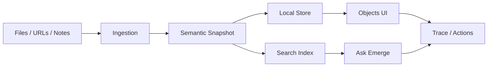
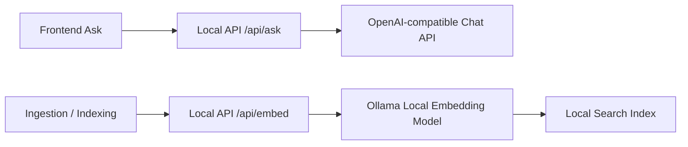

# 架构规划

## 总体结构

## 工程分层

### app/

前端应用。负责页面、交互、视效和数据呈现。

不要把检索、解析、快照生成等核心逻辑写进页面组件。页面只消费契约化的数据。

### server/

本地 API。负责导入、解析、快照生成、索引、查询、Trace 记录。

当前先承接模型 provider：

- OpenAI-compatible：LLM / Ask Emerge。OpenAI 官方、DeepSeek 或其他兼容服务都通过同一组 `OPENAI_*` 配置接入。
- Ollama：本地 embedding，使用 `/api/embed`。

LLM API key 只允许进入本地 `.env.local` 或当前本地 API 进程内存，不能进入源码、README、PRD、截图或普通 settings 文件。

### packages/

共享包。优先放：

- `contracts`：TypeScript 类型、Zod schema、API DTO。
- `ui`：跨页面复用的基础 UI 组件。
- `rag`：检索、rerank、evidence merge 等逻辑。

不急于拆包。只有当同一逻辑被 app/server 同时需要时再提升进 packages。

### desktop/

桌面壳预留目录。用于 Tauri/Electron、本地文件权限、系统托盘、后台索引任务等。

Phase 1 不把它作为主线。

## 数据流

1. 用户添加文件、URL 或笔记。
2. Ingestion 生成原始对象记录。
3. Parser 提取文本、元数据和结构。
4. Snapshot Builder 生成语义快照。
5. Indexer 写入本地检索索引。
6. Objects UI 展示资产状态。
7. Ask Emerge 查询索引并返回证据化回答。
8. Trace 记录输入、检索、引用、输出和动作。

## 模型 Provider

### OpenAI-compatible LLM

- Base URL：`OPENAI_BASE_URL`
- Chat path：`OPENAI_CHAT_PATH`
- Model：`OPENAI_MODEL`
- Secret：`OPENAI_API_KEY`
- OpenAI example：`OPENAI_BASE_URL=https://api.openai.com/v1`、`OPENAI_CHAT_PATH=/chat/completions`
- DeepSeek example：`OPENAI_BASE_URL=https://api.deepseek.com`、`OPENAI_MODEL=deepseek-v4-flash`

### Ollama

- Base URL：`http://localhost:11434`
- Embedding API：`POST /api/embed`
- Model：`OLLAMA_EMBED_MODEL`

## 存储演进

### Phase 1A: Mock JSON

用于 UI 验证和产品演示。

### Phase 1B: SQLite / local files

用于真实本地数据闭环。

### Phase 1C: S3-compatible object store

用于稳定对象身份、内容寻址、快照版本和未来同步。

对象存储不是为了把文件丢到云上，而是为了让每个语义资产拥有可迁移、可追溯、可版本化的对象身份。

## 关键架构约束

- 所有对象必须有稳定 `asset_id`。
- 所有快照必须有 `schema_version`。
- AI 输出必须引用 `evidence_id` 或明确标记为推断。
- 前端必须能处理 partial/error/stale 状态。
- 检索逻辑和 UI 组件不能互相耦合。
