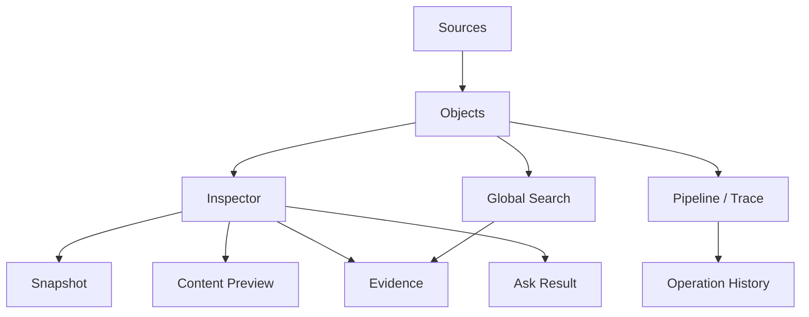

# 01 PRD - Emerge MVP Completion

## 版本

- 文档版本：v1.0
- 日期：2026-06-15
- 范围：从当前 iter-017 继续，完成可交付 MVP
- 读者：产品、开发、测试、后续 AI coding agent

## 背景

个人知识和文件正在从“保存文件”转向“管理可被 AI 理解的语义资产”。传统文件管理器只能展示路径、文件名、时间和大小；聊天工具只能在对话中临时调用上下文；知识库需要用户手工组织结构。

Emerge 的机会是把这些能力合并成一个本地优先的 Objects 工作台：

- 文件、URL、笔记都是语义对象。
- 每个对象都有快照、证据、索引、状态和操作历史。
- 用户可以像管理文件一样管理 AI 可理解的资产。
- LLM 回答必须回到 evidence，而不是飘在聊天记录里。

## 产品目标

MVP 完成后，用户应能完成以下闭环：

1. 添加本地文件、笔记或 URL。
2. 系统抽取文本，生成快照和索引。
3. 用户在 Objects 工作台浏览、筛选、搜索对象。
4. 用户查看对象摘要、证据、内容预览和处理历史。
5. 用户向单个对象或全局资产提问。
6. 系统用本地检索和 LLM 生成带证据引用的回答。
7. 用户能看到每次导入、检索、Ask、索引和失败的 trace。
8. 出错时，用户知道失败原因，并能重试或降级继续使用。

## MVP 成功定义

### 必须达到

- 用户无需阅读代码即可知道本地 API、LLM、Embedding 是否连接。
- 文件管理入口具备“AI 时代文件系统”的基本形态：
  - 对象列表
  - 来源筛选
  - 状态筛选
  - 语义搜索
  - 批量导入
  - 失败状态
  - 重试入口
  - Trace
- 每个本地对象至少有：
  - `asset_id`
  - 来源
  - 状态
  - 原始内容或原始内容引用
  - 索引片段
  - 快照
  - 操作历史
- Ask 回答必须展示：
  - provider
  - model
  - retrieval mode
  - citations
  - embedding fallback 状态
- API key 不落盘。
- 至少有一套 smoke test 覆盖主流程。

### 可以不做

- 多用户账号。
- 云同步。
- 完整知识图谱。
- 插件市场。
- 团队协作。
- 移动端原生 app。
- 复杂网页抓取和登录态网页抓取。

## 用户画像

### 主用户

独立研究者、产品负责人、开发者、创作者。每天会处理大量文档、网页、笔记和代码上下文，希望把它们变成可问、可查、可追踪的个人语义资产。

### 使用场景

- 读白皮书、PRD、技术文档后，想跨文档追问。
- 收藏网页后，想让它进入可检索知识库。
- 写产品或开发文档时，想知道某个结论来自哪个文件。
- 使用多个 LLM 或本地模型时，希望配置和状态可视化。
- 希望未来能迁移到桌面应用，而不是长期靠浏览器 + 终端。

## 用户故事

### US-01 添加资产

作为用户，我希望可以拖拽或选择多个文件导入系统，这样我不需要逐个添加资料。

验收：

- 支持多文件导入。
- 支持 `.txt`、`.md`、`.json`、`.csv`、`.html` 的文本读取。
- 不支持的文件类型必须显示明确错误。
- 导入完成后对象出现在列表顶部。

### US-02 查看处理历史

作为用户，我希望知道一个对象经历了哪些处理步骤，这样我能判断它是否可信。

验收：

- Inspector 或 Pipeline 展示对象 trace。
- Trace 至少包含 ingest、parse、snapshot、index、verify、metadata、ask、search。
- 失败事件展示错误摘要。
- 成功事件展示耗时和结果摘要。

### US-03 重建索引

作为用户，我希望在 embedding 模型变化后重建索引，这样语义搜索能使用新模型。

验收：

- 模型设置变更后提示需要 reindex。
- 对象或全局提供 reindex 入口。
- Reindex 后 chunks 的 `embedding_model` 更新。
- Ollama 不可用时保留词法索引并明确提示。

### US-04 原文和索引预览

作为用户，我希望区分“原始内容”和“索引片段”，这样我知道 AI 实际看到了什么。

验收：

- 对象详情显示原始内容预览。
- 索引预览继续显示 chunks。
- 如果原始内容过长，显示截断状态。
- 如果没有原文，只显示原因和可恢复建议。

### US-05 Ask 和 Search 历史

作为用户，我希望查看我问过什么、系统引用了什么证据，这样我可以复盘和继续研究。

验收：

- Ask 成功或失败都写入 trace。
- Search 查询写入 trace 或 history。
- History 条目能回到对象、问题和 citations。

### US-06 安全模型配置

作为用户，我希望配置 LLM API key 后可以测试连接，但 key 不被写入普通文件。

验收：

- `settings.json` 不包含真实 key。
- UI 不回显真实 key。
- `/api/llm/test` 能区分 `missing_key`、`connected`、`request_failed`。
- 后续桌面版可以接 OS keychain。

## 功能范围

### P0 MVP 必须完成

1. Trace / 操作历史
2. 批量文件导入和基础拖拽
3. Embedding 状态和 reindex
4. 原始内容存储和预览
5. Ask/Search history
6. 错误状态与重试
7. 发布前 smoke test 和回归清单

### P1 强烈建议

1. 桌面壳最小版本
2. OS keychain
3. 文件夹导入
4. 打开原始文件
5. 更清晰的视觉 polish

### P2 后续

1. SQLite
2. S3-compatible object store
3. 多 Agent 工作流
4. 知识图谱
5. 云同步

## 信息架构

## 关键页面

### Objects 工作台

页面区域：

- Header：品牌、Ask、导入、URL、笔记、模型设置、API/LLM 状态。
- Sources：全部、本地文件、笔记、URL、集合、待审。
- Objects：对象列表、搜索、状态筛选、编辑、删除、批量操作。
- Inspector：摘要、内容预览、topics、entities、evidence、actions、metadata、Ask result。
- Pipeline / Trace：处理步骤、操作历史、失败和重试。

### 模型设置

必须包含：

- OpenAI-compatible
  - Base URL
  - Model
  - Provider label
  - Chat Path optional
  - API key runtime-only
- Local Embedding
  - Ollama Base URL
  - Embedding model
  - Test result

### Trace 面板

必须包含：

- 事件时间
- 事件类型
- 状态
- 关联 run id
- 事件摘要
- 可展开详情
- 失败重试入口

## 数据原则

- 所有对象必须有稳定 `asset_id`。
- 所有 evidence 必须有 `evidence_id`。
- 所有 chunk 必须能追溯到 asset 和 evidence。
- 所有 AI 回答必须有 citations 或明确说明证据不足。
- Trace 是一等数据，不是 UI 临时状态。

## 安全原则

- API key 不落盘。
- 测试脚本不能包含真实 key。
- 错误信息不能泄露 key。
- 本地文件路径展示要清楚，但不要上传到任何远端服务。
- LLM 只接收检索出来的 evidence，不默认发送整个 store。

## 验收指标

### 功能

- 10 个文件连续导入不崩。
- 删除对象后，Search/Ask 不再返回该对象证据。
- 模型配置变更后，状态反馈准确。
- Ollama 不可用时，系统降级到词法检索。
- LLM 不可用时，Ask 仍可返回 local-retrieval。

### 体验

- 首屏无空白。
- 常见错误有可执行下一步。
- 文本不重叠。
- 桌面和窄屏都能完成主流程。

### 测试

- `npm run typecheck` 通过。
- `npm run build` 通过。
- `python test-temp\emerge\run-ui-smokes-with-api.py` 通过。
- 每个新功能至少有一个 smoke 或 API test。

## MVP 发布判定

满足以下条件才可称为 MVP 完成：

- P0 全部完成。
- 已知 P1/P2 写入 backlog。
- 文档能让新模型独立继续开发。
- 没有真实 key 泄露。
- 主流程 smoke 全绿。
- 用户可以在本机按 README 启动并完成导入、搜索、Ask、Trace、预览、重试。
