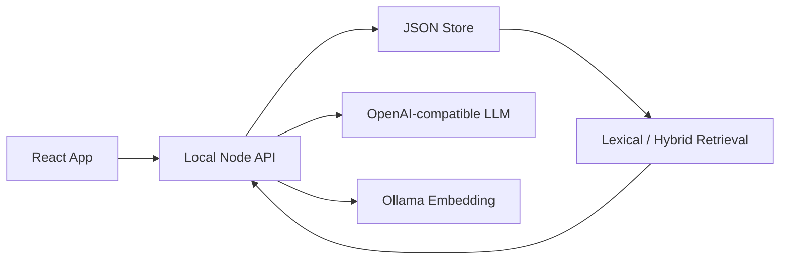

# 02 Implementation Spec

## 目标

本文档描述后续 MVP 开发的工程方案。读者是后续 coding agent。请按迭代顺序小步实现，不要一次性重构全项目。

## 当前架构



## 目录职责

### `app/src`

前端体验。只负责：

- 展示对象、快照、trace、搜索、Ask 结果。
- 发起 API 请求。
- 管理 UI 状态。

不要把检索、embedding、文件解析等核心逻辑写进 React 组件。

### `app/src/api/client.ts`

所有前端到本地 API 的调用都放这里。新增 API 时先在这里加 typed wrapper。

### `app/src/types/domain.ts`

前端领域类型。新增后端返回结构时同步这里。

### `server/src/index.js`

API 路由。保持薄路由：

- 校验输入。
- 调用 store/provider/retrieval 函数。
- 返回 JSON。

不要把大量业务逻辑直接堆进 `route()`。

### `server/src/store.js`

JSON store 的读写和数据生命周期。后续 Trace、原文存储、history、reindex 状态都优先从这里扩展。

### `server/src/retrieval.js`

检索逻辑。只处理 score、merge、fallback、本地摘要。

### `server/src/providers/*`

外部模型接口。只能在 provider 内处理 provider 差异。

## Store 演进

当前 store 已包含：

- `assets`
- `snapshots`
- `pipelineRuns`
- `chunks`
- `traceEvents` 可能已有部分实现

MVP 完成需要扩展为：

```ts
interface Store {
  schemaVersion: string;
  assets: Asset[];
  snapshots: Record<string, SemanticSnapshot>;
  pipelineRuns: PipelineRun[];
  chunks: SearchChunk[];
  traceEvents: TraceEvent[];
  sourceDocuments: SourceDocument[];
  askRuns: AskRun[];
  searchRuns: SearchRun[];
}
```

### `SourceDocument`

用于保存原始内容或原始内容引用。

```ts
interface SourceDocument {
  document_id: string;
  asset_id: string;
  storage_kind: "inline" | "local-path" | "url";
  source_uri: string;
  mime_type?: string;
  size_bytes?: number;
  text_preview?: string;
  text_content?: string;
  text_truncated: boolean;
  created_at: string;
  updated_at: string;
}
```

MVP 可先用 `inline` 保存文本内容。大文件后续再迁移 SQLite 或 object store。

### `TraceEvent`

Trace 是一等数据。

```ts
interface TraceEvent {
  trace_id: string;
  asset_id?: string;
  run_id?: string;
  kind:
    | "ingest"
    | "parse"
    | "snapshot"
    | "index"
    | "verify"
    | "metadata"
    | "ask"
    | "search"
    | "reindex"
    | "delete"
    | "error";
  status: "queued" | "running" | "succeeded" | "failed" | "skipped";
  title: string;
  message?: string;
  duration_ms?: number;
  created_at: string;
  details?: Record<string, unknown>;
}
```

### `AskRun`

```ts
interface AskRun {
  ask_id: string;
  asset_id?: string;
  question: string;
  provider: string;
  model: string;
  retrieval_mode: "lexical" | "hybrid";
  citation_ids: string[];
  answer_preview: string;
  status: "succeeded" | "failed";
  error?: string;
  created_at: string;
}
```

### `SearchRun`

```ts
interface SearchRun {
  search_id: string;
  query: string;
  asset_id?: string;
  retrieval_mode: "lexical" | "hybrid";
  result_count: number;
  status: "succeeded" | "failed";
  error?: string;
  created_at: string;
}
```

## API 扩展计划

### Trace

Add:

```text
GET /api/assets/:asset_id/trace
GET /api/trace?limit=50
```

Response:

```ts
interface ObjectTraceResponse {
  ok: boolean;
  trace: {
    asset_id: string;
    title: string;
    status: AssetStatus;
    runCount: number;
    eventCount: number;
    lastEventAt?: string;
    runs: PipelineRun[];
    events: TraceEvent[];
  };
}
```

### Original content

Add:

```text
GET /api/assets/:asset_id/source
```

Response:

```ts
interface SourceDocumentResponse {
  ok: boolean;
  source: SourceDocument;
}
```

### Reindex

Add:

```text
POST /api/assets/:asset_id/reindex
POST /api/reindex
GET  /api/index/status
```

MVP 可以同步执行 reindex，不需要后台队列。

### History

Add:

```text
GET /api/history/ask?asset_id=:asset_id
GET /api/history/search?asset_id=:asset_id
```

## 前端扩展计划

### Trace UI

文件建议：

- `app/src/components/ObjectTracePanel.tsx`
- `app/src/components/TraceEventList.tsx`

接入位置：

- `PipelineStrip` 下半区或 `SemanticInspector` 新模块。

最低展示：

- 时间
- 类型
- 状态
- 标题
- message
- details 可展开

### 文件管理增强

文件建议：

- 扩展 `ShellHeader` 导入入口。
- 扩展 `ObjectList` 工具栏。
- 新建 `BulkImportSummaryModal.tsx`。

功能：

- 多文件导入状态。
- 拖拽导入。
- 批量失败摘要。
- 对导入失败项给出原因。

### Reindex UI

文件建议：

- `EmbeddingStatusPanel.tsx`
- `ReindexButton.tsx`

接入位置：

- 模型设置弹窗。
- Inspector metadata 区。
- Object list selected toolbar。

### Source preview UI

文件建议：

- `SourcePreviewPanel.tsx`

接入位置：

- Inspector 在 Content Preview 之前或合并为 tabs：
  - Original
  - Indexed chunks

### Ask/Search history UI

文件建议：

- `HistoryPanel.tsx`

接入位置：

- Inspector Ask result 下方。
- Trace 面板中也展示对应事件。

## 错误处理规范

所有 API 错误返回：

```ts
interface ApiError {
  ok: false;
  error: string;
  code?: string;
  details?: unknown;
}
```

前端必须展示用户可理解的信息。

错误文案要求：

- 说明失败动作。
- 说明可能原因。
- 给下一步。

例：

```text
Embedding 连接失败：Ollama 未响应。请确认 Ollama 正在运行，或暂时使用词法检索。
```

## 安全和隐私

- LLM API key 不写入 `settings.json`。
- 测试脚本不得包含真实 key。
- 错误消息要用 `toPublicProviderError()` 或同等逻辑脱敏。
- Ask 只发送检索出的 evidence，不发送完整 store。
- Source preview 是本地内容，不上传给远端 provider。

## 性能约束

MVP 不追求大型数据库性能，但要避免明显卡顿：

- 单次导入 10 个中小文本文件不崩。
- 单对象 500 chunks 内可搜索。
- Object list 1000 条以内能滚动。
- Search debounce 不小于 200ms。

## 实现原则

1. 先扩展类型，再扩展 store，再扩展 API，最后接 UI。
2. 每个新 API 都写一个轻量 smoke 或脚本验证。
3. 每个 UI 入口都要有 loading、success、error、empty 状态。
4. 不做无关抽象。
5. 不把历史乱码文档作为事实源，新事实写入 `docs/mvp-completion/`。
