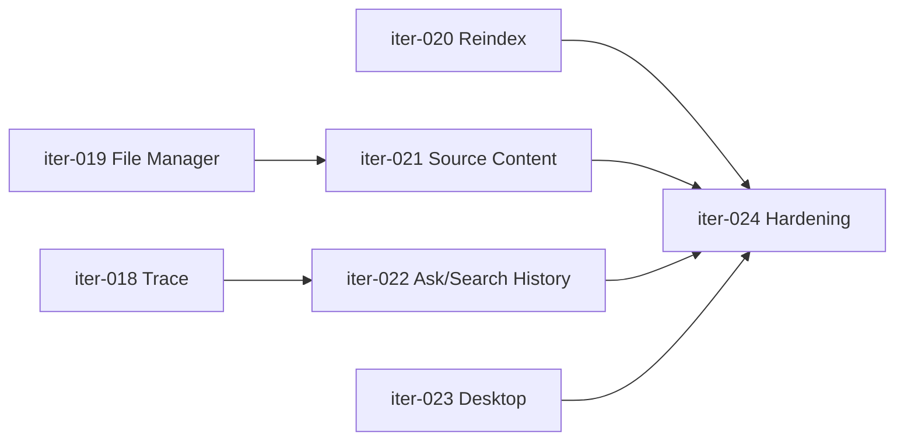

# 03 Iteration Plan

## 总原则

后续开发从 `iter-018` 开始。每次只做一个迭代，不要跨迭代混做。每个迭代完成后：

1. 更新对应 `iterations/iter-NNN-*/ITER.md` 的开发笔记。
2. 更新 `dev-plan.md` 状态。
3. 更新 `ITERATION.md` 状态。
4. 跑相关测试。

## 迭代总表

| 迭代 | 名称 | 优先级 | 目标 | 完成后 MVP 改善 |
|---|---|---|---|---|
| iter-018 | Trace / 操作历史 | P0 | 让对象处理过程可追踪 | 用户知道系统做了什么 |
| iter-019 | AI 文件管理和批量导入 | P0 | 让文件入口可用 | 文件管理入口从原型变为工具 |
| iter-020 | Embedding 状态和重建索引 | P0 | 让混合检索可控 | 模型变化后可恢复搜索质量 |
| iter-021 | 原始内容存储和预览 | P0 | 区分原文和索引片段 | 用户知道 AI 看到了什么 |
| iter-022 | Ask/Search history | P0 | 让问答和检索可复盘 | 研究链路可连续 |
| iter-023 | 桌面壳和 keychain | P1 | 本地优先体验升级 | 降低启动和密钥管理成本 |
| iter-024 | MVP hardening release | P0 | 测试、错误状态、发布文档 | 达到可交付 MVP |

## 依赖关系

`iter-023` 可与其它迭代并行，但如果资源不足，可以放到 MVP 后。若用户坚持“本地优先软件”必须像桌面软件，则 `iter-023` 进入 MVP。

## iter-018 Trace / 操作历史

目标：

- 每个对象都有完整 trace。
- 导入、编辑、删除、Ask、Search、Reindex 都能写入 trace。
- UI 能展示对象级 trace。

必须改：

- `server/src/store.js`
- `server/src/index.js`
- `app/src/api/client.ts`
- `app/src/types/domain.ts`
- `app/src/components/PipelineStrip.tsx`
- 可新增 `ObjectTracePanel.tsx`

验收：

- `GET /api/assets/:id/trace` 返回 events。
- 导入对象后 trace 至少 5 条。
- 编辑 metadata 后 trace 多 1 条。
- 删除前能看到 delete 或即将删除记录。

## iter-019 AI 文件管理和批量导入

目标：

- 支持拖拽导入。
- 支持多文件导入进度。
- 展示批量导入结果。
- 让 Objects 更像 AI 文件管理入口。

必须改：

- `ShellHeader`
- `ObjectList`
- `App.tsx`
- 新增 `BulkImportSummaryModal.tsx`

验收：

- 拖拽文件到页面可导入。
- 多文件导入时逐个显示状态。
- 失败项不影响成功项。
- 错误类型可见。

## iter-020 Embedding 状态和重建索引

目标：

- 用户知道当前检索是 lexical 还是 hybrid。
- 用户知道 embedding 模型是否变更。
- 用户可以重建索引。

必须改：

- `server/src/store.js`
- `server/src/index.js`
- `server/src/providers/ollama.js`
- `app/src/components/ModelSettingsModal.tsx`
- `SemanticInspector` 或新 `EmbeddingStatusPanel`

验收：

- `/api/index/status` 返回 chunks、embeddedChunks、embeddingModel、staleCount。
- `/api/assets/:id/reindex` 可重建单对象。
- `/api/reindex` 可重建全部本地对象。
- Reindex 写 trace。

## iter-021 原始内容存储和预览

目标：

- SourceDocument 成为一等数据。
- 原始内容预览和索引片段预览分开。

必须改：

- `server/src/store.js`
- `server/src/index.js`
- `app/src/api/client.ts`
- `SemanticInspector`
- 新增 `SourcePreviewPanel.tsx`

验收：

- `GET /api/assets/:id/source` 返回原文预览。
- 文件、笔记、URL 都保存 source document。
- 大内容显示截断。
- UI 明确标注 Original 和 Indexed chunks。

## iter-022 Ask/Search history

目标：

- Ask 和 Search 形成历史。
- History 能回到 citations 和对象。

必须改：

- `server/src/store.js`
- `server/src/index.js`
- `server/src/retrieval.js`
- `App.tsx`
- `SemanticInspector`
- 新增 `HistoryPanel.tsx`

验收：

- Ask 成功或失败写 `askRuns`。
- Search 成功或失败写 `searchRuns`。
- `GET /api/history/ask` 可查询。
- UI 显示最近 Ask/Search。

## iter-023 桌面壳和 keychain

目标：

- 建立 Tauri 最小桌面壳。
- 后续可用 OS keychain 存 key。

最低范围：

- 只打开现有 Vite app。
- 不重写业务逻辑。
- 不强制打包发布。
- 写清楚如何运行。

验收：

- `desktop/` 有可执行说明。
- 能启动桌面窗口访问 Emerge UI。
- keychain 方案写入文档，若实现则 API key 不再需要每次输入。

## iter-024 MVP hardening release

目标：

- 清理错误状态。
- 补齐 smoke tests。
- 写发布和演示文档。

必须完成：

- 测试文档更新。
- README 更新。
- 主流程 smoke 全绿。
- 敏感信息扫描。
- 截图更新。
- 已知问题清单。

验收：

- `npm run typecheck` 通过。
- `npm run build` 通过。
- `python test-temp\emerge\run-ui-smokes-with-api.py` 通过。
- 用户按 README 可启动并完成主流程。

## 如果资源不足，最小完成线

如果 Codex 或其它模型额度不足，优先完成：

1. iter-018
2. iter-020
3. iter-021
4. iter-024

可以暂缓：

- iter-023 桌面壳
- iter-022 的完整 UI，只保留 trace 记录也可临时通过

不要暂缓：

- API key 安全
- 主流程 smoke
- Trace 最小可视化
